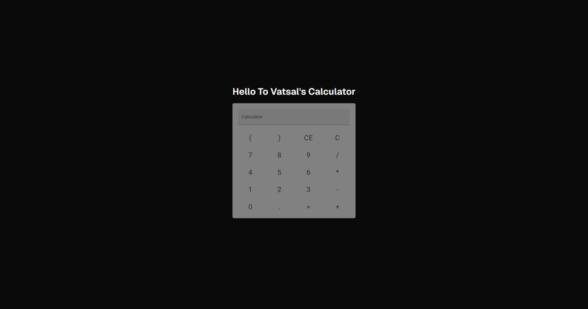

# Simple Calculator App

This is a simple calculator built using [Next.js](https://nextjs.org/) and the React framework.  
It provides basic arithmetic operations with a clean, responsive UI.

## Features

- Addition, subtraction, multiplication, and division
- Keyboard and button input support
- Responsive design using Material UI and custom CSS
- Built with modern React and Next.js App Router

## Screenshot



## Getting Started

1. **Install dependencies:**
   ```bash
   npm install
   ```

2. **Run the development server:**
   ```bash
   npm run dev
   ```

3. Open [http://localhost:3000](http://localhost:3000) in your browser to use the calculator.

## Project Structure

- `src/app/components/Calculator.tsx` – Main calculator component
- `src/app/page.tsx` – Home page
- `src/app/page.module.css` – Global styles

## Tech Stack

- [Next.js](https://nextjs.org/)
- [React](https://react.dev/)
- [Material UI](https://mui.com/)

---

Feel free to use, modify, or extend this calculator for your own projects!
